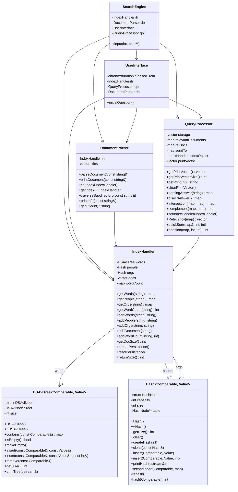

## Design Documentation
This program is a search engine for documents in JSON format. Only sample data is included here because the full dataset is too large to inlcude in the repository. The full dataset can be found at https://www.kaggle.com/jeet2016/us-financial-news-articles. To run the program as is, you need to include a data/archive folder, but you can leave it empty to run with sample data. The program indexes each file by reading the text, removing stopwords, and applying the Porter2 stemming algorithm, then builds data structures (AVL trees, hash tables) that map from words or entity names (people, organizations) to the documents where they appear. This allows for fast lookups of relevant documents when a user enters a query. When the user runs the program, they can parse an entire directory of .json files to build an index, save that index to a file so it can be reused later, load the index back in without re‐parsing all files, and query for specific search terms. The query engine supports normal words, excluded terms (prefixed by -), and special tags for organizations (ORG:) and persons (PERSON:). It then ranks the matching documents (using a simple tf–idf style metric) and prints the most relevant results, with an option to view each document’s text. 

## UML Diagram

## Collaborators
William Bjorndahl

## Sources
1) https://chatgpt.com/c/67ba5084-4014-8001-b3ec-381ec8a3fa7e?model=o1
2) https://claude.ai/chat/4e6cd8d2-a82f-4a20-b51b-c1d1fe3ed052
3) https://www.cursor.com/en
4) https://github.com/msappel4/cs5393-002_project4/blob/main/howtorun.txt
